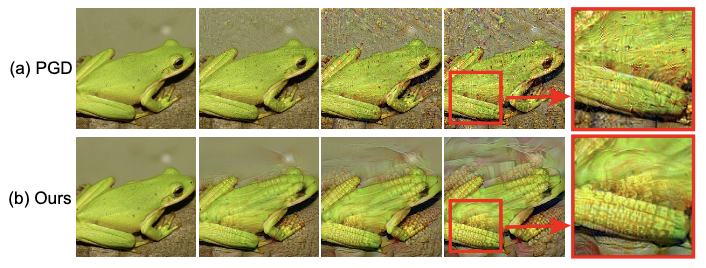

This is the official PyTorch implementation of "Towards Understanding and Boosting Adversarial Transferability from a Distribution Perspective".

>**Abstract:** Transferable adversarial attacks against Deep neural networks (DNNs) have received broad attention in recent years. An adversarial example can be crafted by a surrogate model and then attack the unknown target model successfully, which brings a severe threat to DNNs. The exact underlying reasons for the transferability are still not completely understood. Previous work mostly explores the causes from the model perspective, e.g., decision boundary, model architecture, and model capacity. adversarial attacks against Deep neural networks (DNNs) have received broad attention in recent years. An adversarial example can be crafted by a surrogate model and then attack the unknown target model successfully, which brings a severe threat to DNNs. The exact underlying reasons for the transferability are still not completely understood. Previous work mostly explores the causes from the model perspective, e.g., decision boundary, model architecture, and model capacity.
Here, we investigate the transferability from the data distribution perspective and hypothesize that pushing the image away from its original distribution can enhance the adversarial transferability. To be specific, moving the image out of its original distribution makes different models hardly classify the image correctly, which benefits the untargeted attack, and dragging the image into the target distribution misleads the models to classify the image as the target class, which benefits the targeted attack.
Towards this end, we propose a novel method that crafts adversarial examples by manipulating the distribution of the image. We conduct comprehensive transferable attacks against multiple DNNs to demonstrate the effectiveness of the proposed method. Our method can significantly improve the transferability of the crafted attacks and achieves state-of-the-art performance in both untargeted and targeted scenarios, surpassing the previous best method by up to 40% in some cases. In summary, our work provides new insight into studying adversarial transferability and provides a strong counterpart for future research on adversarial defense 



#  Preparation

First, please download the dataset from the following link and extract images to the path “./SubImageNet224/”:
https://drive.google.com/drive/folders/1JAkrWOEU4qLUEMy0X5LcSUUJMNTOoyE0?usp=sharing

Second, please download our DRA models from the following link and extract models to the path “./DRA/”:
https://drive.google.com/drive/folders/1JAkrWOEU4qLUEMy0X5LcSUUJMNTOoyE0?usp=sharing


# Generate Adversarial examples

You can generate adversarial examples with PGD, SGM and our DRA. 

**Example 1:** Generating adversarial examples with the widely used PGD attack and save the adversarial examples into "./gen_images/resnet50_PGD_eps16_step10"
>CUDA_VISIBLE_DEVICES=0 python attack.py --gamma 1 --output_dir ./gen_images/resnet50_PGD_eps16_step10 --arch resnet50 --batch-size 80 --advertorch 1 --epsilon 16 --num-steps 10

"gamma=1" means do not use the SGM method. 
"advertorch=1" means using the attack provided in the advertorch lib. 
"epsilon=16" means that we constrain the perturbation into 16/255 l-infty ball.
"num-steps" means the iteration steps.
"arch" choices:  "resnet50", "resnet152", "densenet121", "densenet201", "vgg19_bn"

**Example 2:** Generating adversarial examples with the our DRA attack and save the adversarial examples into "./gen_images/resnet50_DRA_eps16_step10"
>CUDA_VISIBLE_DEVICES=0 python attack.py --gamma 1 --output_dir ./gen_images/resnet50_DRA_eps16_step10 --arch resnet50 --batch-size 80 --DRA 1 --epsilon 16 --num-steps 10

"DRA=1" means that we use our DRA method to generate adversarial examples.


**Example 3:** Generating adversarial examples with the SGM attack and save the adversarial examples into "./gen_images/resnet50_SGM_eps16_step10"
>CUDA_VISIBLE_DEVICES=0 python attack.py --gamma 0.25 --output_dir ./gen_images/resnet50_SGM_eps16_step10 --arch resnet50 --batch-size 80 --advertorch 1 --epsilon 16 --num-steps 10

Set --gamma 0.25(for resnet), 0.5(for densenet) to use the method SGM. (According to the suggestion from the paper https://arxiv.org/abs/2002.05990


#  Evaluate the Transferability

You can evaluate the adversarial transferability against different defense methods: “None,Augmix,SIN,SIN-IN,Linf-0.5,Linf-1.0,L2-0.05,L2-0.1,L2-0.5,L2-1.0”
"None" means attack the normally trained models.

"Augmix" models can be downloaded from https://drive.google.com/file/d/1z-1V3rdFiwqSECz7Wkmn4VJVefJGJGiF/view

"SIN" models can be downloaded from https://bitbucket.org/robert_geirhos/texture-vs-shape-pretrained-models/raw/6f41d2e86fc60566f78de64ecff35cc61eb6436f/resnet50_train_60_epochs-c8e5653e.pth.tar

"SIN-IN" models can be downloaded from https://bitbucket.org/robert_geirhos/texture-vs-shape-pretrained-models/raw/60b770e128fffcbd8562a3ab3546c1a735432d03/resnet50_train_45_epochs_combined_IN_SF-2a0d100e.pth.tar

Download the defense models and save these models to the dir "./defense_models".

Linf and L2 adversarially trained robust models can be downloaded from https://github.com/microsoft/robust-models-transfer

Download the robust models and save these models to the folder "./robust_models".


**Example 1:** evaluate the adversarial transferability of our DRA attack from the ResNet-50 source model to the target model inceptionresnetv2.
>CUDA_VISIBLE_DEVICES=0 python validate.py --input_dir ./gen_images/resnet50_DRA_eps16_step10 --arch inceptionresnetv2 --batch-size 80 --defense_methods None

**Example 2:** evaluate the adversarial transferability of our DRA attack from the ResNet-50 source model to the target model senet154.
>CUDA_VISIBLE_DEVICES=0 python validate.py --input_dir ./gen_images/resnet50_DRA_eps16_step10 --arch senet154 --batch-size 80 --defense_methods None

**Example 3:** evaluate the adversarial transferability of our DRA attack from the ResNet-50 source model to the target robust resnet50 (defense model adversarially trained with Linf-1.0).
>CUDA_VISIBLE_DEVICES=0 python validate.py --input_dir ./gen_images/resnet50_DRA_eps16_step10 --arch senet154 --batch-size 80 --defense_methods Linf-1.0

arch choices: vgg19_bn densenet121 densenet201 resnet152 senet154 inceptionresnetv2 inceptionv4 inceptionv3 etc.

## Citation

If you find our work and this repository useful. Please consider giving a star ⭐ and citation.

```
@article{zhu2022boosting,
  title={Towards Understanding and Boosting Adversarial Transferability from a Distribution Perspective},
  author={Yao Zhu, Yuefeng Chen, Xiaodan Li, Kejiang Chen, Yuan He, Xiang Tian, Bolun Zheng, Yaowu Chen, Qingming Huang},
  booktitle={IEEE Transaction on Image Processing},
  year={2022}
}
```

